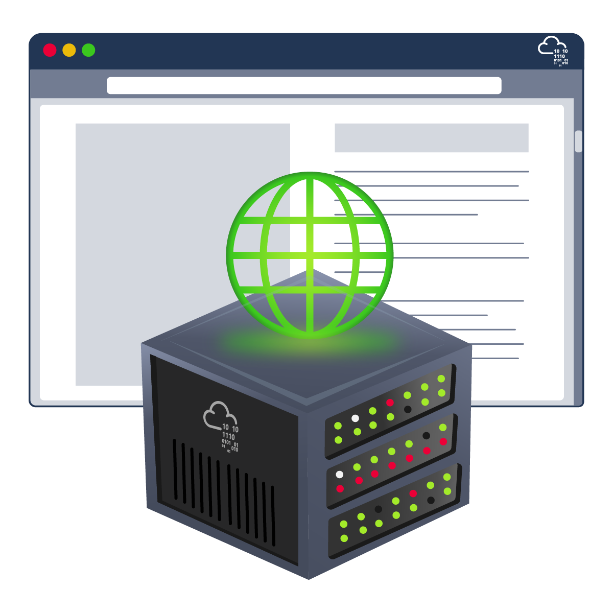

## Web Application Security

### Learn about web applications and explore some of their common security issues



### Task 1 Introduction

1. **What do you need to access a web application?**

    ```
    browser
    ```

## Task 2 Web Application Security Risk

1. **You discovered that the login page allows an unlimited number of login attempts without trying to slow down the user or lock the account. What is the category of this security risk?**

    ```
    Identification and Authentication Failure
    ```

2. **You noticed that the username and password are sent in cleartext without encryption. What is the category of this security risk?**
  
    ```
    Cryptographic Failures
    ```

## Task 3 Pracical Example of Web Application Security

1. **Check the other users to discover which user account was used to make the malicious changes and revert them. After reverting the changes, what is the flag that you have received?**
  
    Due to site vulnerability to IDOR, we can brute force or manipulate the id of user and rever all change.

    ```
    THM{IDOR_EXPLORED}
    ```