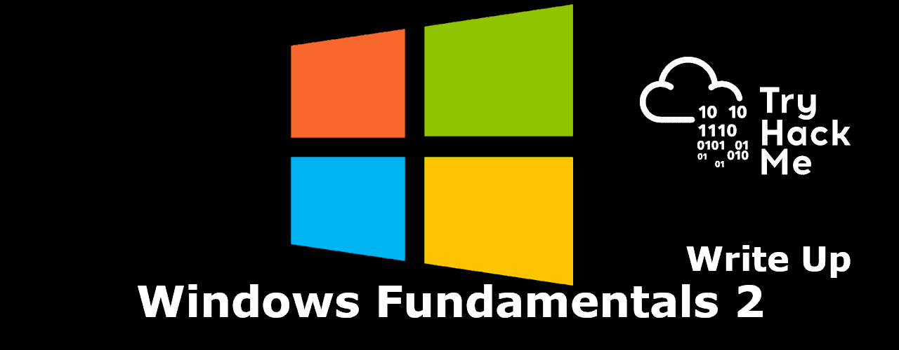

# Windows Fundamental Part 1

<p align="center">
  
</p>

### Task 2 System Configuration
1. **What is the name of the service that lists Systems Internals as the manufacturer?**
    ```
    PsShutdown
    ```

2. **Whom is the Windows license registered to?**
    ```
    Windows User
    ```

3. **What is the command for Windows Troubleshooting?**
    ```
    C:\Windows\System32\control.exe /name Microsoft.Troubleshooting
    ```

4. **What command will open the Control Panel? (The answer is  the name of .exe, not the full path)**
    ```
    control.exe
    ```

### Task 3 Change UAC Settings
1. **What is the command to open User Account Control Settings? (The answer is the name of the .exe file, not the full path)**
    ```
    UserAccountControlSettings.exe
    ```

### Task 4 Computer Management
1. **What is the command to open Computer Management? (The answer is the name of the .msc file, not the full path)**
    ```
    compmgmt.msc
    ```

2. **At what time every day is the GoogleUpdateTaskMachineUA task configured to run?**
    ```
    6:1**5 AM**
    ```

3. **What is the name of the hidden folder that is shared?**
    ```
    sh4r3dF0Ld3r
    ```

### Task 5 System Information
1. **What is the command to open System Information? (The answer is the name of the .exe file, not the full path)**
    ```
    msinfo32.exe
    ```

2. **What is listed under System Name?**
    ```
    THM-WINFUN2
    ```

3. **Under Environment Variables, what is the value for ComSpec?**
    ```
    %SystemRoot%\system32\cmd.exe
    ```

### Task 6 Resource Monitor
1. **What is the command to open Resource Monitor? (The answer is the name of the .exe file, not the full path)**
    ```
    resmon.exe
    ```

### Task 7 Command Prompt
1. **In System Configuration, what is the full command for Internet Protocol Configuration?**
    ```
    C:\Windows\System32\cmd.exe /k %windir%\system32\ipconfig.exe
    ```

2. **For the ipconfig command, how do you show detailed information?**
    ```
    ipconfig /all
    ```

### Task 8 Registry Editor
1. **What is the command to open the Registry Editor? (The answer is the name of  the .exe file, not the full path)**
    ```
    regedt32.exe
    ```