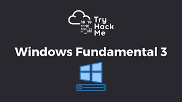

# Windows Fundamental Part 3

<p align="center">
  
</p>

### Task 2 Windows Updates
1. **There were two definition updates installed in the attached VM. **On what date were these updates installed?
    ```
    5/3/2021
    ```

### Task 3 Windows Security
1. **In the above image, which area needs immediate attention?
    ```
    Virus & threat protection
    ```

### Task 4 Virus & Threat Protection
1. **Specifically, what is turned off that Windows is notifying you to turn on?
    ```
    Real-time protection
    ```

### Task 5 Firewall & network protection
1. **If you were connected to airport Wi-Fi, what most likely will be the active firewall profile?
    ```
    Public Network
    ```

### Task 7 Device Security
1. **What is the TPM?
    ```
    Trusted Platform Module
    ```

### Task 8 BitLocker
1. **What must a user insert on computers that DO NOT have a TPM version 1.2 or later?
    ```
    usb startup key
    ```

### Task 9 Volume Shadow Copy Service
1. **What is VSS?
    ```
    Volume Shadow Copy Service
    ``